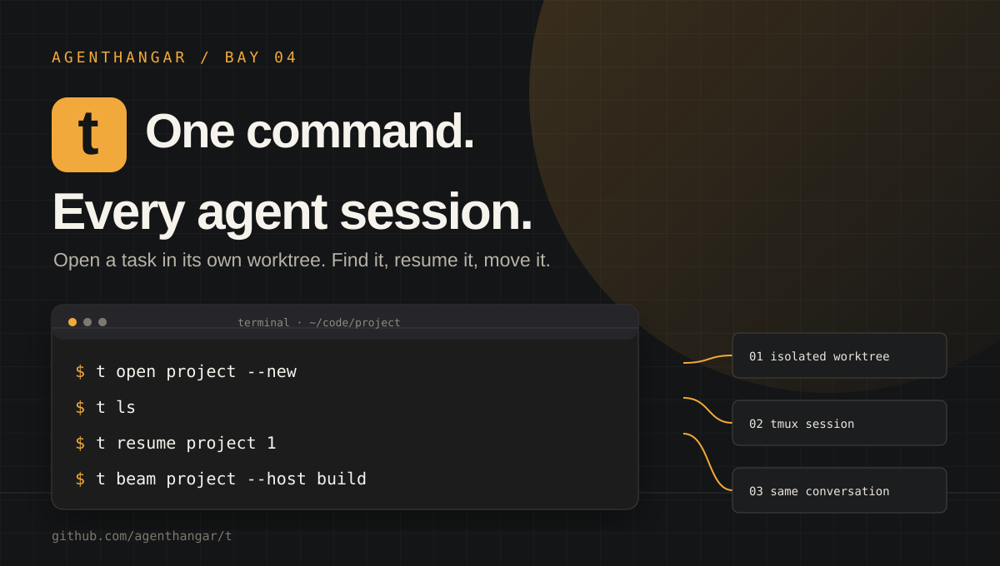
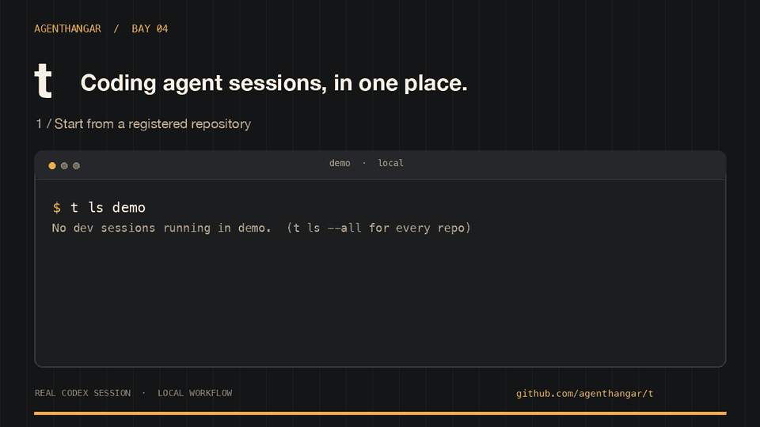

# t



**A 24/7 coding utility. Take your work with you.**

Start a task with your coding agent, keep it running on a remote machine, and
pick it up from your laptop or a phone's SSH terminal. Move between local and
cloud development, or bring a local Codex conversation into its macOS desktop
app with the running web preview beside it.

t manages sessions in tmux and gives each task its own Git worktree. It includes
Claude Code and Codex session workflows, plus Cursor transfer tools.

[Get started](#install) · [Work from anywhere](#work-from-anywhere) · [Commands](#commands) · [Configuration](#configuration) · [Agent support](#agents) · [Coming soon](#coming-soon) · [AgentHangar](https://agenthangar.ai)



The [demo recording](docs/media/README.md) explains exactly what was captured.
Watch the [MP4](docs/media/demo.mp4) or use the [static poster](docs/media/demo-poster.png).

## Work from anywhere

- **Start with your agent.** `t open my-project` gives Claude Code an isolated
  worktree and tmux session; add `--codex` to use Codex. Detach and come back to
  the same session whenever you need it.
- **Move between local and cloud development.**
  `t beam my-project 1 --host cloud` moves the session to a configured SSH host;
  `t beam my-project 1 --from cloud` brings it back. Use your own workstation or
  cloud VM with t and your agent installed.
- **Take it on the go.** Connect to that host from your phone's SSH terminal.
  `t ls` shows the sessions, `t read my-project 1 --dump` lets you scroll their
  output, and `t open my-project 1` reconnects you. A detached session stays
  available while its host stays awake and reachable.
- **Move between terminal and desktop.** On macOS, `t app my-project 1` opens
  the same local Codex conversation in the desktop app, along with its web
  preview and referenced Markdown plan. The worktree and dev server stay in
  place. To return, finish the desktop turn, then use `codex resume <thread-id>`
  from that worktree; use one interface at a time for the conversation.

**Coming soon:** submit work to your agent framework, starting with
[AgentCore](https://github.com/agenthangar/t/issues/9), and use
[Teleport for SSH access](https://github.com/agenthangar/t/issues/10).

## Install

You need **zsh, Python 3, Git, and tmux**. Install `fzf` for the interactive pickers,
`gh` for GitHub integration, and `rsync`/SSH for moving sessions between hosts.
The test suite runs on macOS and Linux with Python 3.12. Desktop handoff is macOS-only.

```sh
curl -fsSL https://raw.githubusercontent.com/agenthangar/t/main/scripts/install-release.py | python3
```

This installs the latest tagged release under `~/.local/share/t/releases/` and
links the command into `~/bin`. No repository checkout or pip packages are needed.
The installer verifies the release archive's SHA-256 checksum before unpacking it.
Set `XDG_DATA_HOME` or `T_INSTALL_DIR` to choose another installation location.
You can also download and inspect the installer before running it with Python 3.

Add these lines to **your own `~/.zshrc`**, then open a new terminal:

```zsh
export PATH="$HOME/bin:$PATH"
source "${${:-$HOME/bin/t}:A:h:h}/t.plugin.zsh"
```

The source expression follows the installed executable, including a development
worktree selected with `t update --dev`. The installer prints it too. t does not
replace your shell configuration, tmux settings, SSH config, or global Git defaults.

```sh
t install          # choose and install agent CLIs; review their vendor commands
t setup            # register local repositories and optional SSH hosts
t open my-project  # start an isolated worktree + tmux slot
t ls               # see your running sessions
```

Detach from tmux with `Ctrl-b d`; reattach with `t open my-project 1`.
Repositories need a fetched `origin/main` for worktree sessions. `t new` can create
and register a GitHub repository with the expected setup, showing its plan first.
Use `t doctor` when something is missing.

## Commands

| Command | Purpose |
| --- | --- |
| `t open <repo> [slot]` | Open/reattach an isolated task; `--new` starts another, `--codex` selects Codex |
| `t ls [-r] [-a]` | List sessions, optionally across remote hosts and all repositories |
| `t cd [repo] [slot]` | Move the current shell into the selected worktree |
| `t resume` | Find and resume a saved conversation |
| `t push` / `t pop` | Move between a foreground agent and a detached tmux session |
| `t beam <repo> [slot] --host <host>` | Move a session to another host; `--from <host>` pulls it here |
| `t read <repo> [slot]` | Read the slot's terminal log; `--dump` writes plain scrollable output |
| `t find <query>` | Find saved Claude conversations by their content |
| `t plan` / `t paste` | Open a session's plan or pass an attachment to it |
| `t config` | Configure tools, models, effort, Fast mode, repositories, and hosts |
| `t setup` / `t new` | Register existing repositories or create one |
| `t install` | Install/log in agent CLIs; `--status` reports what is present |
| `t trust` | Explicitly trust selected repositories in installed agents |
| `t permissions` | Inspect/apply an explicitly configured permission policy |
| `t mcp` | Serve the sessions MCP tools; `--install` registers the server |
| `t app` | Hand a local Codex conversation to its macOS desktop app |
| `t on <host> <command>` | Run a command through the host's login zsh |
| `t kill <repo> <slot>` | Stop the selected slot; scoped process cleanup protects shared infrastructure |
| `t update` | Install the latest release and reload the shell integration |
| `t doctor` | Diagnose the independent t installation and optional integrations |

Every command has `-h`. Repo-aware commands infer the repository from your current
directory, so `t open 2` and `t cd 2` work inside a registered repository.

## Configuration

**Your preferences, or shared enterprise defaults.** Choose the agents and models
that work for you, and use a common open/resume/handoff workflow across supported
vendors. `t config` sets agent defaults, models, effort, Fast mode, repository
choices, and hosts. Teams can share those defaults alongside their preferred
workflows and agent configurations to standardize the parts of their setup that
matter.

Configure which MCP tools load in each agent's own settings. t preserves those
settings and provides its own optional sessions MCP server for Claude Code;
it does not centrally manage other MCP servers. The optional permission policy
below can also be shared across supported agents. See the [agent matrix](#agents)
for the capabilities available in each vendor's tool.

The plugin reads `${XDG_CONFIG_HOME:-~/.config}/t/local.zsh`; override its location
with `T_LOCAL_RC` before sourcing the plugin. Start with [local.zsh.example](local.zsh.example)
or use `t setup` / `t config`.

```zsh
DEV_REPOS[api]="$HOME/code/my-api"
DEV_AGENT[api]=codex
REMOTE_HOSTS[workstation]=user@workstation
```

Local config is executable zsh: keep it private and only load trusted files. The
Python CLI reads a generated data-only bridge in `~/.config/t/config.sh`, never
executes your config. SSH hosts need the same plugin loaded in their `.zshrc`.
Use a matching home-relative repository layout on machines that exchange work.
No SSH server, credentials, or network tunnel is provisioned by t.

### Permissions and folder trust

Installing t preserves existing agent choices. Automatic folder trust and the
maintainer's personal permission defaults are not enabled for a standalone install.
Use `t trust <dir>` to make a deliberate folder-trust change. To opt into automatic
trust for registered repositories, set `export T_AUTO_TRUST=1` in your local config.

To use your own permission rules, point `T_PERMISSIONS_DIR` at a directory containing
`permissions.allow` and `permissions.retire`, inspect `t permissions`, then apply
with `t permissions --apply`. Agent mode/network/subagent defaults require the
separate `T_PERMISSION_DEFAULTS=1` opt-in or `--defaults`; a missing policy is a no-op.
Custom rules and existing explicit choices are preserved. `T_NO_TRUST`,
`T_NO_PERMISSIONS`, `T_NO_AGENT_MODES`, and `T_NO_SUBAGENT_MODEL` disable those paths.

### Updates and development

```sh
t --version       # installed release, or developer checkout revision
t update           # latest tagged release; Git installs update main instead
t update --relink  # repair links from the selected source, without fetching
```

Updates are explicit: run `t update`, or let `dots` run it as part of your dotfiles
update. There is no background updater. Your configuration and agent conversations
remain outside the installation. If the command's link is broken, rerun the install
command above. To install a specific release:

```sh
curl -fsSL https://raw.githubusercontent.com/agenthangar/t/main/scripts/install-release.py | python3 - --version v0.2.0
```

Contributors can use a Git checkout instead:

```sh
git clone https://github.com/agenthangar/t.git ~/code/t
~/code/t/install.sh
```

For a Git installation, `t update` fetches and fast-forwards `main`. The canonical
clone stays on `main`; develop in a session worktree (`t open t` after
registering the t repository). From that worktree, `t update --dev` makes its files
live. Ordinary `t update` switches back without resetting or removing the worktree.
Dirty or divergent canonical checkouts are refused. Avoid editing canonical main:
its files are the installed command. A full install enables a repository-local
pre-commit hook to guard that live checkout. If you already set `core.hooksPath`,
the installer preserves it; include t's guard in that custom hook path yourself.

To repair a Git installation directly, run `~/code/t/install.sh`.

### Optional integrations

The installer adds t's hooks and the sessions MCP server without replacing unrelated
settings. `T_NO_MCP=1` and `T_NO_CODEX_HOOKS=1` opt out. The `claude-stamp-tmux` hook
keeps its historical executable name and also supports Codex.

[t's original dotfiles](https://github.com/agenthangar/dotfiles) provide optional
iCloud transcript sync, clipboard bridging, and personal shell utilities. They are
not prerequisites. On that installation, `dots --all` updates dotfiles and t, and
the adapter preserves existing personal permission/trust choices.

## Agents

Features differ by agent. This matrix is generated from the command's own help and
checked in CI; optional dotfiles integrations are identified explicitly.

```text
  surface                                                     ✱ claude                                   ⬡ codex                                                        ◆ cursor
  ----------------------------------------------------------  -----------------------------------------  -------------------------------------------------------------  -------------------------------------------------
  t install (install · login · update · reinstall)            ✓                                          ✓                                                              ✓
  dev slots: t open / ls / kill / read / paste                ✓                                          ✓ t open --codex · DEV_AGENT                                   ✗ no slot — t cursor ls
  t push / t pop                                              ✓                                          ✓                                                              ✗ no slot
  t resume (dead slots)                                       ✓                                          ✓ (its sqlite thread index)                                    → t cursor resume
  t beam / --from (move a session)                            ✓                                          ✓ (rollout + .origin)                                          → t cursor [id] --host / --from
  t app (desktop + browser preview)                           ✗ Codex conversations only                 ✓ local macOS slot → same thread                               ✗
  csync (iCloud union of transcripts)                         ✓ projects + plans                         ✓ codex-sessions                                               ✓ cursor-chats
  SessionStart stamps (registry · opened · origin)            ✓ settings.json hook                       ✓ hooks.json (trust once at startup)                           ✗ no hook wired
  t plan                                                      ✓                                          ✗ codex keeps no plan files (says so)                          ✗
  /tpush · /tpop slash commands                               ✓ ~/.claude/commands                       ✓ ~/.codex/prompts                                             ✗
  t find / t mcp (transcript search)                          ✓                                          ✗ claude transcripts only                                      ✗
  t doctor agent row (version · login · hook)                 ✓                                          ✓                                                              ✓ version · login
  t permissions (selected policy)                             ✓ ~/.claude/settings.json                  ✓ ~/.codex/rules/t.rules (argv prefixes) · sandbox network on  ✓ ~/.cursor/cli-config.json (argv + env prefixes)
  default permission mode (opt in with --defaults)            ✓ auto (permissions.defaultMode)           ✓ full access (approval never · danger-full-access)            ✗ left as cursor-agent set it
  default subagent model (seeded when the config names none)  ✓ sonnet (env.CLAUDE_CODE_SUBAGENT_MODEL)  ✓ gpt-6-sol ([agents] default_subagent_model)                  ✗ not seeded
  t trust (folder trust · optional auto trust)                ✓ ~/.claude.json projects                  ✓ ~/.codex/config.toml [projects]                              ✓ ~/.cursor/projects/<slug> marker
  nosleep (hold sleep while an agent works)                   ✓ caffeinate child · net bytes             ✓ net bytes                                                    ✓ net bytes
```

## Coming soon

These integrations are planned and are not available in the current release:

- **Amazon Bedrock AgentCore support** — [track progress](https://github.com/agenthangar/t/issues/9).
- **Teleport support for SSH workflows** — [track progress](https://github.com/agenthangar/t/issues/10).

## Development

```sh
python3 -m pip install -r requirements-dev.txt
python3 -m pytest --cov --cov-fail-under=97
zsh -n t.plugin.zsh
```

The installer has no pip runtime dependencies. Markdown rendering uses a small
vendored library with its [license and provenance](libexec/vendor/README.md).
Read [CONTRIBUTING.md](CONTRIBUTING.md) and [AGENTS.md](AGENTS.md) before changing
session ownership, worktree cleanup, or the remote protocol.

MIT — [license](LICENSE). Built by [AgentHangar](https://agenthangar.ai).
